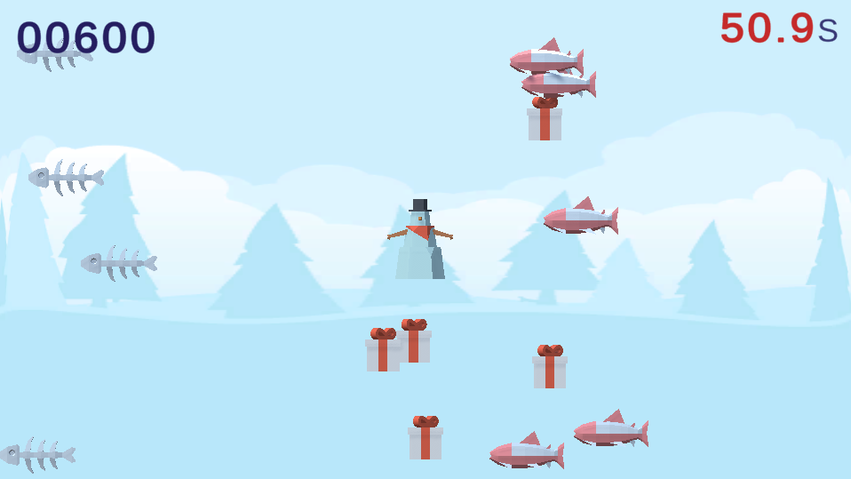

# Portfolio

- 真島祐志
- 連絡先 Email [dat.gp1219@gmail.com](mailto:dat.gp1219@gmail.com)
- 専門学校デジタルアーツ東京 ゲームプログラムコース 2023年卒業予定

## スキル
- C#
  - 利用歴1年
  - Unityのスクリプトに使用
- Unity
  - 利用歴1年
  - オリジナルの個人/チーム作品の開発経験あり
- C/C++
  - 利用歴4年
  - Visual Studioで簡単なデータ処理プログラムができる

## 取り組んでいるテーマ
- 何か最低一つ考えてください

## 作品リスト

[unityroom MASHIMA](https://unityroom.com/users/gxkhm78p51nuqca0ot9l)

### 正しい扉

[正しい扉](https://unityroom.com/games/tadasii)

作品概要

- 開発環境：Unity
- 開発期間：10日
- 個人制作

### SuperUnitychanSisters1

SuperUnitychanSisters1

作品概要

- 開発環境：Unity
- 開発期間：約2か月
- チーム制作  プログラム担当

### Yoketoru2021

[Yoketoru2021](https://unityroom.com/games/yoketoru2021_m)

作品概要

- 開発環境：Unity
- 開発期間：約1か月
- 個人制作

## 連絡先
- E-mail [dat.gp1219@gmail.com](mailto:dat.gp1219@gmail.com)
