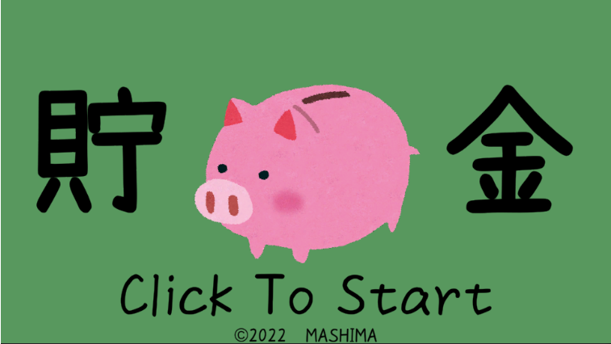
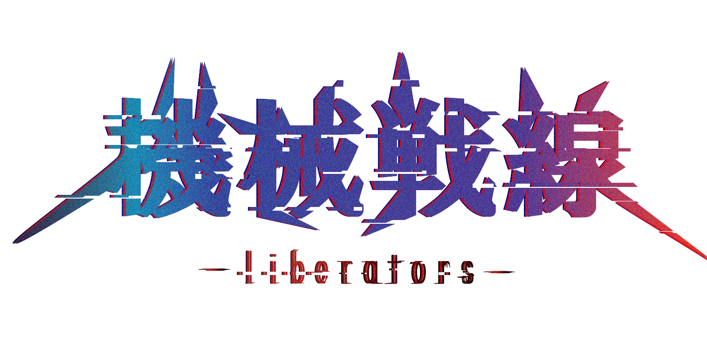
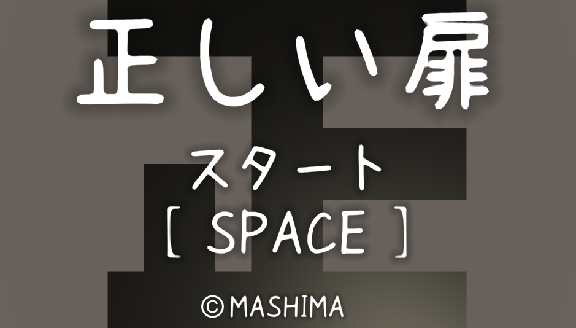

- 真島祐志
- 連絡先 Email [dat.gp1219@gmail.com](mailto:dat.gp1219@gmail.com)
- 専門学校デジタルアーツ東京 ゲームプログラムコース 2023年卒業予定

## 資格
- 情報技術検定2級

## スキル
- C#
  - 利用歴1年
  - Unityのスクリプトに使用
- Unity
  - 利用歴1年
  - オリジナルの個人/チーム作品の開発経験あり
- C/C++
  - 利用歴4年
  - Visual Studioで簡単なデータ処理プログラムができる

## 取り組んでいるテーマ
- ノベル育成ゲームの制作
- 3Dアクションゲームの制作

## 作品リスト

[unityroom MASHIMA](https://unityroom.com/users/gxkhm78p51nuqca0ot9l)

### 貯金

[貯金](https://unityroom.com/games/tyokin) 
[ソースコード](https://github.com/msm-16/source-code)

作品概要 
時間内でたくさん貯金するゲーム

- 開発環境：Unity
- 開発開始時期：2022年9月
- 開発時間：4日
- 個人制作
- Unity 1週間ゲームジャム お題「ためる」
 

### Unityでゲームのガチャシステム
[Unityでゲームのガチャシステム](https://qiita.com/msm_dat/items/3ccc60dd0836240b7321) 

作品概要 
どうすればゲームのガチャシステムが再現できるのかを調べ、 
実際にあるゲームのガチャ内容を参考に制作してみました。

- 開発環境：Unity
- 開発開始時期：2022年8月
- 開発時間：4日
- 個人研究
 

### 機械戦線 -liberators-

作品概要 
3Dアクションゲーム

- 開発環境：Unity
- 開発開始時期：2022年5月
- 開発時間：開発中
- チーム制作　プログラム担当
- 卒業制作
 

### flowerShop サイコトリップ 感情を持つ”3つの花”

作品概要
ノベル育成ゲーム

- 開発環境：Unity
- 開発開始時期：2022年2月
- 開発時間：開発中
- チーム制作　プログラム担当
 

### 正しい扉

[正しい扉](https://unityroom.com/games/tadasii) 
[ソースコード](https://github.com/msm-16/source-code)

作品概要
時間内に5つの部屋から正解の部屋を探す。

- 開発環境：Unity
- 開発開始時期：2021年12月
- 開発時間：10日
- 個人制作
- 正月課題、Unity 1週間ゲームジャム お題「正」
 

### SuperUnitychanSisters1

SuperUnitychanSisters1

作品概要 
敵や障害物を避けてゴールを目指すプラットフォームゲーム。

- 開発環境：Unity
- 開発開始時期：2021年10月
- 開発時間：約20日
- チーム制作  プログラム担当
- 学園祭展示
 

### Yoketoru2021

[Yoketoru2021](https://unityroom.com/games/yoketoru2021_m) 
[ソースコード](https://github.com/msm-16/source-code)

作品概要 
60秒間敵をよけるながらアイテムをとるゲーム

- 開発環境：Unity
- 開発開始時期：2021年7月
- 開発時間：約10日
- 個人制作
- 夏休み課題
 

## 連絡先
- E-mail [dat.gp1219@gmail.com](mailto:dat.gp1219@gmail.com)
